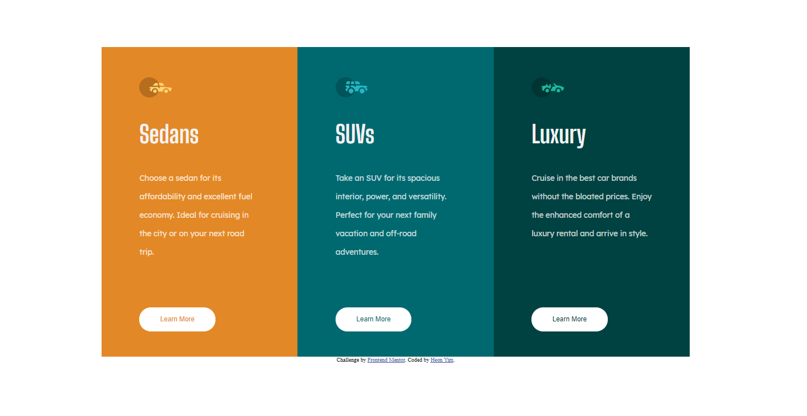

# Frontend Mentor - 3-column preview card component solution

This is a solution to the [3-column preview card component challenge on Frontend Mentor](https://www.frontendmentor.io/challenges/3column-preview-card-component-pH92eAR2-). Frontend Mentor challenges help you improve your coding skills by building realistic projects. 

## Table of contents

- [Overview](#overview)
  - [The challenge](#the-challenge)
  - [Screenshot](#screenshot)
- [My process](#my-process)
  - [What I learned](#what-i-learned)
  - [Useful resources](#useful-resources)
- [Author](#author)

## Overview

### The challenge

Users should be able to:

- View the optimal layout depending on their device's screen size
- See hover states for interactive elements

### Screenshot

## My process

### What I learned

- margin: auto --> centers div
- border-radius --> could be %, could be px 
  - px and % yield different results 
- position: absolute relative to parent 

### Useful resources

- [center div](https://www.w3schools.com/css/css_align.asp) 
- [border-radius](https://www.w3schools.com/css/tryit.asp?filename=trycss3_border-radius)  
- [position: absolute, relative to parent](https://stackoverflow.com/questions/10487292/position-absolute-but-relative-to-parent)  

## Author

- Frontend Mentor - [@12345120](https://www.frontendmentor.io/profile/yourusername)

